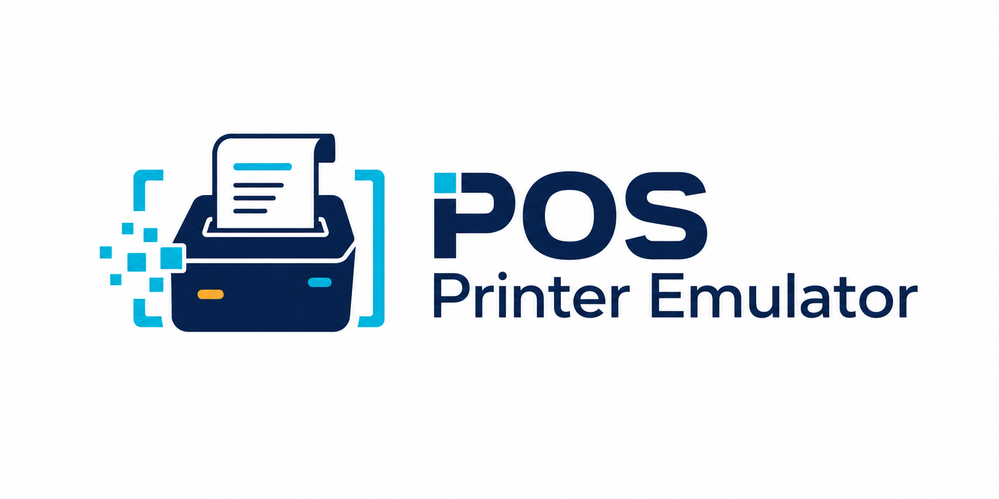

# POS Printer Emulator

POS Printer Emulator is a local Windows ESC/POS receipt emulator for testing point-of-sale printer output without a physical thermal printer. It listens for RAW printer traffic on TCP port `9100`, parses common Epson ESC/POS commands, and displays each receipt in a desktop HTML application.



## Highlights

- RAW TCP/IP listener on `0.0.0.0:9100` with cut-command and idle-timeout job framing.
- Receipt preview with persistent Light and Dark viewing modes.
- Trial Mode by default with five emulated print jobs per day, session-only jobs, a receipt watermark, and locked premium controls.
- Offline signed activation keys that immediately unlock unlimited jobs, persistent history, watermark-free receipts, exports, and premium features without reinstalling.
- ESC/POS text, alignment, emphasis, underline, character sizing, feeds, cuts, basic barcodes, QR command tracking, and common code pages.
- Command diagnostics with byte offsets, hexadecimal values, and unsupported-command reporting.
- Maximum job-size protection and interrupted-connection recovery.
- Text and raw-data exports plus Print-to-PDF.
- Native C# desktop window hosting the HTML viewer through Microsoft WebView2, with no browser address bar.
- All-in-one Windows installer—customers do not separately install .NET, WebView2, Node.js, CMake, a database, or printer utilities.
- Service, firewall, health-check, uninstall, build, publish, and developer utility operations are implemented in C# without PowerShell.
- Automatic Windows Service registration, delayed startup, failure recovery, and private/domain firewall configuration.
- Guided Printer Setup Wizard that detects and installs the signed Epson TM-T88V Receipt5 driver, creates the RAW TCP/IP port and Windows queue, verifies the connection, rolls back incomplete setup, and sends a test receipt.
- Privacy-safe license and usage reporting with a password- and authenticator-protected owner dashboard; receipt contents and raw printer data never leave the customer computer.
- Clean uninstall through Windows **Installed apps** or the Start Menu.

Feature upgrades and the `v0.MINOR.FEATURE` numbering sequence are tracked in [CHANGELOG.md](CHANGELOG.md).

The public `posprinteremulator.com` marketing and download website is maintained in [`website`](website/README.md).

## Install on Windows

POS Printer Emulator supports 64-bit Windows 10 and Windows 11.

1. Download `POSPrinterEmulatorSetup-0.3.11-win-x64.exe` from the repository's Releases page.
2. Run the installer and approve the Windows administrator prompt.
3. Enter the customer or company name and email address that will be used for licensing.
4. Leave **Create a desktop shortcut** selected if desired.
5. Open **POS Printer Emulator** from the Start Menu or desktop shortcut.

Setup installs POS Printer Emulator and its desktop HTML component under Program Files, starts its background service, and permits inbound TCP `9100` traffic on private and domain networks. Public-network access is intentionally not enabled. The local viewer remains available at `http://127.0.0.1:5187` for diagnostics.

After installation, open **Settings → Printer Setup Wizard**. The wizard asks where the POS software runs, chooses `127.0.0.1:9100` automatically for a same-computer setup, verifies the Epson driver, and installs the Windows printer after one administrator confirmation. Customers do not need to open Windows printer settings, create a port, visit Epson's website, or select a driver manually.

Open **Settings → Printer State** to simulate Ready, Paper Low, Paper Out, Cover Open, Cutter Error, Offline, and custom error conditions. Connected POS clients receive Epson-compatible `DLE EOT` real-time responses and `GS a` Automatic Status Back notifications whenever the simulated state changes.

> The current development installer is not code-signed, so Windows SmartScreen may show a warning. Production releases should be signed with a trusted Windows code-signing certificate.

## Connect a POS application

Configure the POS system as a RAW or network receipt printer using:

- **Host:** the Windows computer's local network IP address
- **Port:** `9100`
- **Protocol:** RAW TCP/IP

The diagnostic viewer remains local to the Windows computer at `http://127.0.0.1:5187`.

## Trial and Full versions

Every new installation begins in **Trial Mode**. Trial Mode permits five completed emulated print jobs per local calendar day. Trial jobs remain available only for the current service session, every receipt displays a visible trial watermark, and exports and premium controls are locked.

After purchase, open **License** in the application and enter the customer/company name, email address, and activation key. A valid key immediately enables the **Full Version** with:

- unlimited emulated print jobs;
- persistent print-job history of up to 500 jobs;
- watermark-free receipt previews;
- text and raw-data exports, Print/PDF, and all premium controls.

Activation is validated offline using a public-key signature. The customer does not reinstall the application or download another package. Activation keys are tied to the registered customer/company name and email address.

## License and usage dashboard

Version 0.3.11 reports installation registration, Trial or Full status, application version, launch counts, emulated print-job counts, and last-seen time to the HTTPS telemetry API at `posprinteremulator.com`. Receipt text, raw ESC/POS payloads, barcodes, QR-code contents, and rendered receipt images are never uploaded.

The protected owner portal is hosted at `https://admin.posprinteremulator.com/`. Password sign-in is followed by a six-digit authenticator-app challenge. First-time enrollment presents a locally rendered QR code; its TOTP secret and the activation-key signing key remain in the web host's blocked `private` directory. The portal includes the usage dashboard and a web License Manager for issuing signed customer keys and reviewing issued licenses. The application reports in the background; an unavailable internet connection never blocks receipt emulation.

The MariaDB schema is stored in `database/schema.sql`. The C# utilities under `tools/POSPrinterEmulator.DatabaseTool` and `tools/POSPrinterEmulator.WebsitePublisher` provision the schema, verify the production API, publish the site, and upload protected server configuration. All database, SFTP, and dashboard credentials are supplied through temporary environment variables and must never be committed to Git.

## Uninstall

Open Windows **Settings → Apps → Installed apps**, find **POS Printer Emulator**, and select **Uninstall**. You can also use **Uninstall POS Printer Emulator** from the Start Menu.

Uninstall removes the Windows Service, firewall rules, service-owned application data, shortcuts, and installed application files.

## Development requirements

- .NET SDK 8 or newer
- Node.js 22 and pnpm
- Inno Setup 6 for compiling the Windows installer
- Git and GitHub CLI for source control and releases

CMake is not required by this project.

## Run locally

```console
dotnet run --project tools/ReceiptLab.Build -- build
dotnet run --project src\ReceiptEmulator.App
```

Open `http://127.0.0.1:5187` and select **Test receipt**, or send a sample job from another terminal:

```console
dotnet run --project tools/ReceiptLab.Build -- send-sample
```

## Test

```console
dotnet run --project tools/ReceiptLab.Build -- test
```

## Build

Create a self-contained Windows application bundle:

```console
dotnet run --project tools/ReceiptLab.Build -- publish
```

Output: `artifacts\win-x64`

Create the complete customer installer:

```console
dotnet run --project tools/ReceiptLab.Build -- installer
```

Output: `artifacts\installer\POSPrinterEmulatorSetup-0.3.11-win-x64.exe`

The C# build utility compiles the viewer, builds the application, runs the automated tests, publishes the self-contained runtime, packages the installer, and sends sample ESC/POS traffic. The `artifacts` directory is excluded from Git source history.

The packaged executable also provides Windows installer commands used by Inno Setup:

```console
ReceiptEmulator.exe --install-windows
ReceiptEmulator.exe --uninstall-windows
ReceiptEmulator.exe --health-check
```

The install and uninstall commands require administrator privileges. They are intended to be called by Setup rather than run manually.

## Publish a GitHub release

After authenticating GitHub CLI and pushing the repository, publish the installer with:

```console
gh auth login
gh release create v0.3.11 artifacts/installer/POSPrinterEmulatorSetup-0.3.11-win-x64.exe --title "POS Printer Emulator 0.3.11" --notes "Printer State simulation with Epson DLE EOT real-time responses, GS a Automatic Status Back, common fault scenarios, recovery handling, and diagnostics."
```

## Issue customer activation keys

The vendor private key is intentionally stored outside this Git repository and must never be included in the application or installer. Back it up securely before selling licenses. Issue a key with the exact registration details supplied by the customer:

```console
dotnet run --project tools/POSPrinterEmulator.LicenseTool -- issue --private-key "..\License Keys\vendor-private-key.pem" --customer "Customer or Company Name" --email "customer@example.com"
```

Send the printed `PPE1-...` value to the customer. The corresponding public key is embedded in the application and can validate the key without internet access.

For unattended installation, provide the required registration fields:

```console
POSPrinterEmulatorSetup-0.3.11-win-x64.exe /VERYSILENT /CustomerName="Company Name" /CustomerEmail="customer@example.com"
```

## Configuration

Development settings are stored in `src/ReceiptEmulator.App/appsettings.json`:

- `Printer:Port`: RAW listener port; default `9100`.
- `Printer:BindAddress`: listener address; default `0.0.0.0`.
- `Printer:IdleJobTimeoutMilliseconds`: completes a no-cut job after inactivity.
- `Printer:MaximumJobBytes`: rejects oversized jobs.
- `Viewer:Url`: local viewer binding; default `http://127.0.0.1:5187`.

## Current MVP limitations

The current build stores Full-Version history as local JSON job records with a 500-job retention limit. SQLite migrations, online revocation/transfer, hardened Thermal rendering, PNG export, and production code-signing remain planned work.

See [the architecture notes](docs/architecture.md) for implementation details and the production roadmap.

## License

Licensed under the [Apache License 2.0](LICENSE).
