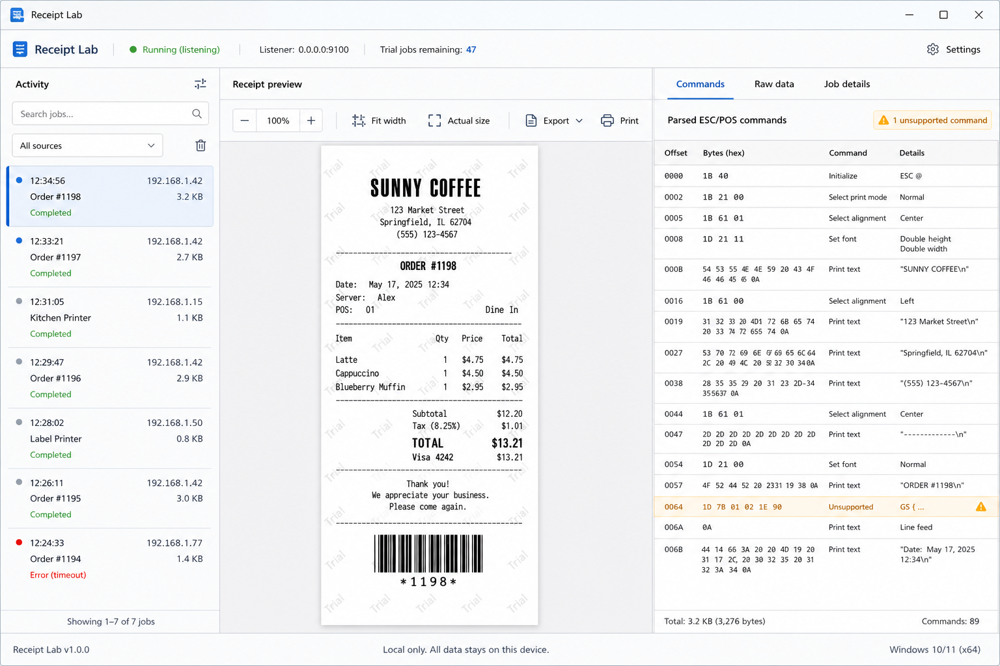

# Receipt Lab

Receipt Lab is a local Windows ESC/POS receipt emulator for testing point-of-sale printer output without a physical thermal printer. It listens for RAW printer traffic on TCP port `9100`, parses common Epson ESC/POS commands, and displays each receipt in a browser-based diagnostic viewer.



## Highlights

- RAW TCP/IP listener on `0.0.0.0:9100` with cut-command and idle-timeout job framing.
- Receipt preview with persistent Light and Dark viewing modes.
- ESC/POS text, alignment, emphasis, underline, character sizing, feeds, cuts, basic barcodes, QR command tracking, and common code pages.
- Command diagnostics with byte offsets, hexadecimal values, and unsupported-command reporting.
- Maximum job-size protection and interrupted-connection recovery.
- Text and raw-data exports plus browser Print-to-PDF.
- Self-contained Windows installer—customers do not install .NET, Node.js, CMake, a database, or printer utilities.
- Service, firewall, health-check, uninstall, build, publish, and developer utility operations are implemented in C# without PowerShell.
- Automatic Windows Service registration, delayed startup, failure recovery, and private/domain firewall configuration.
- Clean uninstall through Windows **Installed apps** or the Start Menu.

## Install on Windows

Receipt Lab supports 64-bit Windows 10 and Windows 11.

1. Download `ReceiptLabSetup-0.1.0-win-x64.exe` from the repository's Releases page.
2. Run the installer and approve the Windows administrator prompt.
3. Leave **Create a desktop shortcut** selected if desired.
4. Open Receipt Lab from the Start Menu or visit `http://127.0.0.1:5187`.

Setup installs Receipt Lab under Program Files, starts its background service, and permits inbound TCP `9100` traffic on private and domain networks. Public-network access is intentionally not enabled.

> The current development installer is not code-signed, so Windows SmartScreen may show a warning. Production releases should be signed with a trusted Windows code-signing certificate.

## Connect a POS application

Configure the POS system as a RAW or network receipt printer using:

- **Host:** the Windows computer's local network IP address
- **Port:** `9100`
- **Protocol:** RAW TCP/IP

The diagnostic viewer remains local to the Windows computer at `http://127.0.0.1:5187`.

## Uninstall

Open Windows **Settings → Apps → Installed apps**, find **Receipt Lab**, and select **Uninstall**. You can also use **Uninstall Receipt Lab** from the Start Menu.

Uninstall removes the Windows Service, firewall rule, service-owned Receipt Lab data, shortcuts, and installed application files.

## Development requirements

- .NET SDK 8 or newer
- Node.js 22 and pnpm
- Inno Setup 6 for compiling the Windows installer
- Git and GitHub CLI for source control and releases

CMake is not required by this project.

## Run locally

```console
dotnet run --project tools/ReceiptLab.Build -- build
dotnet run --project src\ReceiptEmulator.App
```

Open `http://127.0.0.1:5187` and select **Test receipt**, or send a sample job from another terminal:

```console
dotnet run --project tools/ReceiptLab.Build -- send-sample
```

## Test

```console
dotnet run --project tools/ReceiptLab.Build -- test
```

## Build

Create a self-contained Windows application bundle:

```console
dotnet run --project tools/ReceiptLab.Build -- publish
```

Output: `artifacts\win-x64`

Create the complete customer installer:

```console
dotnet run --project tools/ReceiptLab.Build -- installer
```

Output: `artifacts\installer\ReceiptLabSetup-0.1.0-win-x64.exe`

The C# build utility compiles the viewer, builds the application, runs the automated tests, publishes the self-contained runtime, packages the installer, and sends sample ESC/POS traffic. The `artifacts` directory is excluded from Git source history.

The packaged executable also provides Windows installer commands used by Inno Setup:

```console
ReceiptEmulator.exe --install-windows
ReceiptEmulator.exe --uninstall-windows
ReceiptEmulator.exe --health-check
```

The install and uninstall commands require administrator privileges. They are intended to be called by Setup rather than run manually.

## Publish a GitHub release

After authenticating GitHub CLI and pushing the repository, publish the installer with:

```console
gh auth login
gh release create v0.1.0 artifacts/installer/ReceiptLabSetup-0.1.0-win-x64.exe --title "Receipt Lab 0.1.0" --notes "Initial Windows MVP release."
```

## Configuration

Development settings are stored in `src/ReceiptEmulator.App/appsettings.json`:

- `Printer:Port`: RAW listener port; default `9100`.
- `Printer:BindAddress`: listener address; default `0.0.0.0`.
- `Printer:IdleJobTimeoutMilliseconds`: completes a no-cut job after inactivity.
- `Printer:MaximumJobBytes`: rejects oversized jobs.
- `Viewer:Url`: local viewer binding; default `http://127.0.0.1:5187`.

## Current MVP limitations

The current build uses session-only receipt storage and a persisted five-completed-jobs-per-day trial counter. Licensing activation, SQLite licensed history, hardened Thermal rendering, PNG export, and production code-signing remain planned work.

See [the architecture notes](docs/architecture.md) for implementation details and the production roadmap.

## License

Licensed under the [Apache License 2.0](LICENSE).
